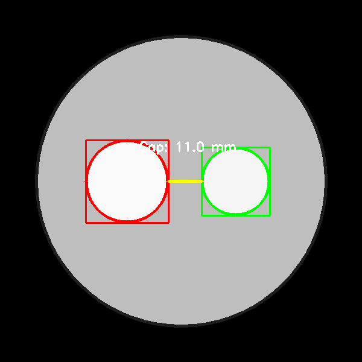
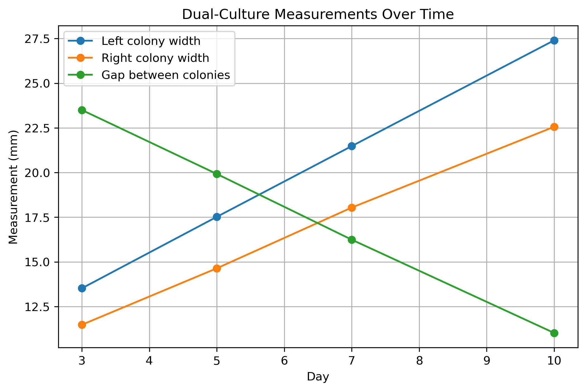

# BioVisionLab

[](https://github.com/Zahra-Shahedi/BioVisionLab/actions/workflows/tests.yml)

BioVisionLab is a Python-based biological image-analysis toolkit.

The first module focuses on automated measurement of fungal dual-culture Petri dish assays. It was started to address a real research bottleneck: manually measuring fungal growth across hundreds or thousands of plate images.

## Why this project matters

Manual measurement of dual-culture plates can be slow, repetitive, and affected by user judgment. BioVisionLab aims to make this workflow faster, more reproducible, and easier to check.

## Current workflow

BioVisionLab currently takes:

* a folder of plate images
* an experiment configuration file

and produces:

* measurement CSV
* annotated quality-control images
* summary growth/gap plot
* text report

## Example output

### Annotated dual-culture plate



### Dual-culture growth and gap summary



## Current measurements

The dual-culture module currently extracts:

* left colony width
* right colony width
* left colony growth toward the opposing colony
* right colony growth toward the opposing colony
* gap between colonies
* detection status for each image

## Command-line tools

After installing BioVisionLab with:

```bash
pip install -e .
```

the following command-line tools are available:

```bash
biovisionlab-analyze
biovisionlab-contact-sheet
biovisionlab-validate-mock
```

Example analysis command:

```bash
biovisionlab-analyze \
    --input data/both_white_dual_culture \
    --output results/demo_results.csv \
    --annotated results/demo_annotated \
    --config config/dual_culture_mock.json \
    --plot results/demo_plot.png \
    --report results/demo_report.txt
```
## Run demo

From the project folder:

```bash
./scripts/run_demo.sh
```

The demo script will generate mock dual-culture images, analyze them, and save a CSV, annotated quality-control images, a summary plot, and a text report.

## Run tests

BioVisionLab includes automated tests for metadata parsing and validation.

From the project folder:

```bash
python -m unittest discover -s tests -v
```

## Project documentation

- [Real-image protocol](docs/real_image_protocol.md)
- [Changelog](CHANGELOG.md)
- [Roadmap](ROADMAP.md)


## Citation and license

BioVisionLab is released under the MIT License.

If you use this project, please cite it using the information in:

[CITATION.cff](CITATION.cff)

See the license file here:

[LICENSE](LICENSE)

## Long-term goal

The long-term goal is to expand BioVisionLab into a reusable toolkit for biological image analysis, including fungal plate assays, plant disease images, roots, seeds, and microscopy images.

Future versions may include machine learning and deep learning models for more complex segmentation and prediction tasks.
